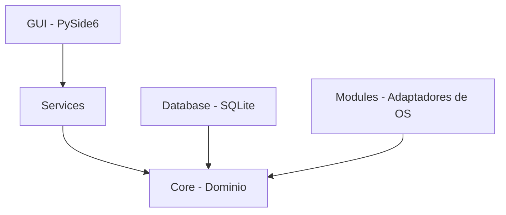

# Sentinel Firewall

[](https://www.python.org/downloads/release/python-3130/)
[](https://opensource.org/licenses/MIT)

> Un firewall personal avanzado y monitor de seguridad en tiempo real, diseñado para operar de forma nativa en entornos Windows y Linux.

---

## Objetivo y Alcance

**Sentinel Firewall** es una herramienta de seguridad de naturaleza **estrictamente defensiva**. Su propósito fundamental es proporcionar monitoreo continuo y protección activa para el equipo local en el que se despliega. 

> **Nota importante:** Este proyecto ha sido diseñado bajo principios éticos; por lo tanto, no incluye ni soportará capacidades ofensivas, técnicas de evasión de seguridad o explotación de vulnerabilidades contra sistemas de terceros.

---

## Características Principales

Sentinel proporciona una suite completa de herramientas para administrar y visualizar la seguridad de la red de tu dispositivo local:

- **Dashboard Integrado:** Un panel de control central con métricas clave, estado general del sistema y estadísticas de tráfico en tiempo real.
- 

- **Monitor de Tráfico y Conexiones:** Visualización en vivo de todas las conexiones activas, puertos en uso y aplicaciones que se están comunicando a través de la red.
- 

- **Sistema de Alertas en Tiempo Real:** Detección de anomalías, intentos de conexión sospechosos y notificaciones de seguridad inmediatas.
- 

- **Gestión Avanzada de Reglas de Firewall:** Creación, edición y eliminación de reglas de bloqueo (por IP, puerto o protocolo). Integración nativa con el firewall subyacente del sistema operativo.
- **Auditoría de Procesos:** Monitor de procesos del sistema que relaciona la actividad de red con los ejecutables locales correspondientes.
- **Escáner Local:** Herramientas integradas para realizar diagnósticos y escanear configuraciones del entorno local.
- **Historial y Logs:** Registro persistente y detallado de eventos de seguridad y conexiones pasadas para su posterior auditoría.
- **Interfaz Moderna y Responsiva:** Desarrollado con PySide6 y Qt, ofreciendo una experiencia de usuario fluida, soporte para tema oscuro y una arquitectura visual modular.

---

## Arquitectura del Sistema

El proyecto implementa una arquitectura por capas (Clean Architecture) orientada al dominio. Esto garantiza alta mantenibilidad, escalabilidad y una separación de responsabilidades robusta, aislada del framework visual y del sistema operativo base.

Para un análisis técnico detallado, consulte la documentación oficial en el directorio `docs/`.

**Flujo y jerarquía de dependencias:**



---

## Estructura del Código

El código fuente se encuentra organizado modularmente:

| Directorio | Descripción |
| :--- | :--- |
| `core/` | Entidades de dominio e interfaces (contratos). Es el núcleo de la aplicación, independiente del SO y de librerías gráficas. |
| `modules/` | Implementaciones concretas por sistema operativo que resuelven las interfaces requeridas por el `core`. |
| `services/` | Casos de uso de la aplicación. Orquestan la interacción fluida entre el `core`, los `modules` y la persistencia. |
| `gui/` | Interfaz gráfica moderna implementada en PySide6, estructurada en vistas, viewmodels, widgets personalizados y estilos. |
| `database/` | Capa de persistencia local mediante SQLite (repositorios y modelos ORM/SQL). |
| `config/` | Configuración global y gestión de parámetros operativos del sistema. |
| `utils/` | Herramientas transversales: sistema centralizado de logging, validadores de red y comprobación de privilegios de ejecución. |
| `tests/` | Batería de pruebas automatizadas (unitarias y de integración) separadas lógicamente por capa. |

---

## Guía de Instalación

Siga estos pasos para configurar el entorno de desarrollo e instalar las dependencias necesarias:

1. **Crear un entorno virtual:**
   ```bash
   python -m venv .venv
   ```

2. **Activar el entorno virtual:**
   - **En Windows:**
     ```cmd
     .venv\Scripts\activate
     ```
   - **En Linux / macOS:**
     ```bash
     source .venv/bin/activate
     ```

3. **Instalar dependencias del sistema:**
   ```bash
   pip install -r requirements.txt
   ```

---

## Ejecución de la Aplicación

Para iniciar el monitor y la interfaz gráfica, ejecute el punto de entrada principal:

```bash
python main.py
```

> **Requisitos de Privilegios (Elevación):**
> Varias funciones críticas de red (ej. bloqueo activo de IPs, cierre de puertos e integración con el firewall nativo del sistema) requieren ser ejecutadas con **privilegios de Administrador en Windows o `root` en Linux**. 
> La aplicación está diseñada para detectar dinámicamente sus permisos actuales y reflejará cualquier limitación de forma clara en la interfaz de usuario, garantizando que el sistema no falle silenciosamente.

---

## Pruebas y Aseguramiento de Calidad

La validación del sistema se realiza mediante el framework `pytest`. Para ejecutar la suite completa de pruebas unitarias y de integración:

```bash
pytest
```

---

## Contribución

¡Las contribuciones son bienvenidas! Si deseas contribuir a mejorar este proyecto:

1. Realiza un *fork* del repositorio.
2. Crea una rama para tu característica (`git checkout -b feature/NuevaCaracteristica`).
3. Realiza tus cambios y asegúrate de que pasen todas las pruebas de código.
4. Haz *commit* de tus cambios (`git commit -m 'Añade NuevaCaracteristica'`).
5. Haz *push* a la rama (`git push origin feature/NuevaCaracteristica`).
6. Abre un *Pull Request* detallando tus cambios.

## Licencia

Este proyecto está bajo la Licencia MIT. Consulta el archivo `LICENSE` para más detalles.
